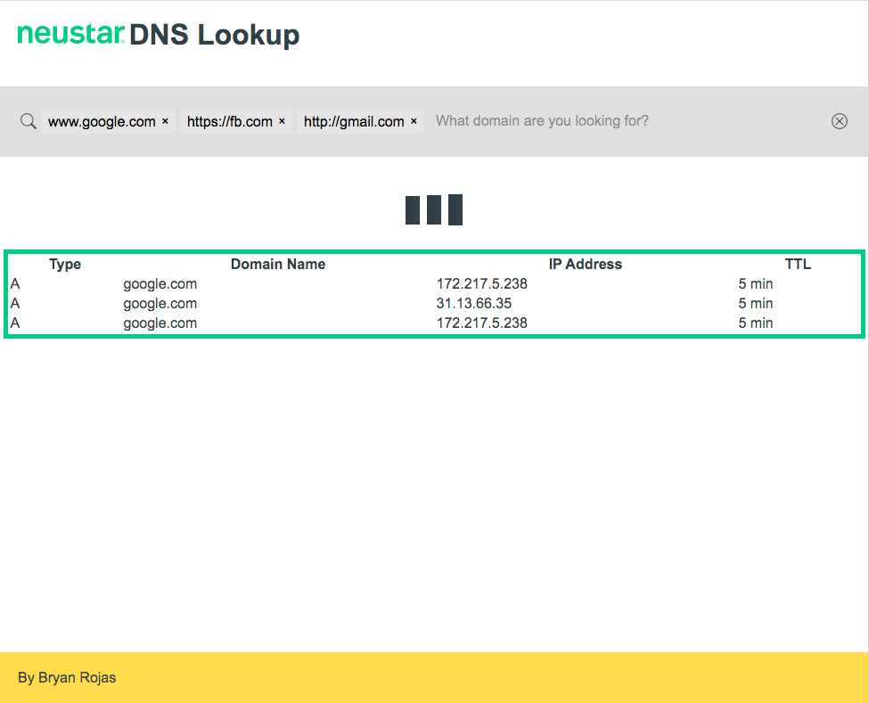

# Code Challenge for [Neustar](neustar.home)

## Requirements

### Frontend

Create a form to submit a list of domains and display the results using AJAX.

### Backend

Should accept a list of domains.

Lookup (this part refers to a DNS lookup not a regular DB lookup) the list of domains' DNS records, save the returned records to a sqlite database, and return the results as JSON. 

The lookup should check the SQLite database first for an existing entries.

Create unit test(s).

** NOTE: Please follow good software engineering practices. In addition to a working program, unit tests should be produced. Treat this as if it was production code being delivered to a client. It should be properly packaged and delivered with sufficient documentation and instructions also provided. You must also describe how to deploy and monitor your solution. **

** You may also use a PHP framework of your choice, Zend Expressive for bonus points. **

## Technologies
* Vagrant Box on Linux to share working nicely
* PHP 7
* OOP
* SQLite
* PHPUnit
* Interface: HTML5, CSS3, Javascript
* Async App

## Installation
1. **Set VM environment**

[Install Virtualbox](https://www.virtualbox.org/)

[Install Vagrant](https://www.vagrantup.com/downloads)

2. **Get the code running**

`git clone https://github.com/bryanrojasq/challenge-neustar.git` 

`cd challenge-neustar`

`vagrant up`

3. **Your app is now running at**

[http://192.168.33.10/](http://192.168.33.10/)

4. **Optional - Do you want custom URL?**

`vagrant suspend`

`echo '192.168.33.10 neustar.dev' | sudo tee -a /etc/hosts`

`vagrant up`

[http://neustar.dev/](http://neustar.dev/)

### Other commands

`./vendor/bin/phpunit tests`

`./vendor/bin/phpunit --testdox tests`

`composer dump-autoload`

## Documentation

* tool: [VM Box - box.scotch.io](https://box.scotch.io)
* website: [Zend Expressive Official](https://zendframework.github.io)
* video: [Zend Expressive For API Building](https://www.youtube.com/playlist?list=PLAXvd3M1ib-YaZau98FNrupwa_F8eatOY)
* video: [PHP REST API Project with Zend Expressive](https://www.youtube.com/playlist?list=PL6_nF0awZMoMol4RPLf99WIZuoJ3l87oG)
* website: [SQLite - PHP](https://www.tutorialspoint.com/sqlite/sqlite_php.htm)
* website: [PHPUnit](https://phpunit.de/getting-started/phpunit-9.html)
* tool: [Tagify - JS Plugin](https://yaireo.github.io/tagify/)
* doc: [dns_get_record](https://www.php.net/manual/en/function.dns-get-record.php)
* inspiration: [SuperTool by mxtoolbox](https://mxtoolbox.com/SuperTool.aspx)

## [👍🏻 Buy me a coffee with Paypal ☕️](https://paypal.me/bryanrojasq)

## More Information

Check-out [bryanrojasq.wordpress.com](https://bryanrojasq.wordpress.com) to learn more.

